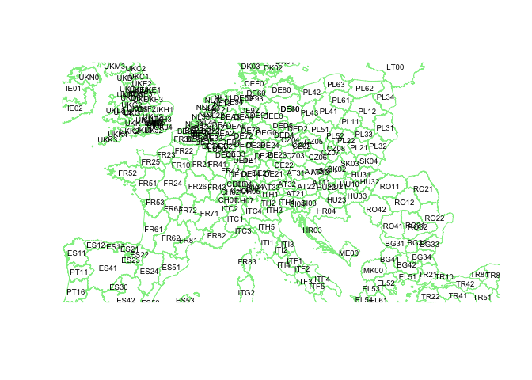
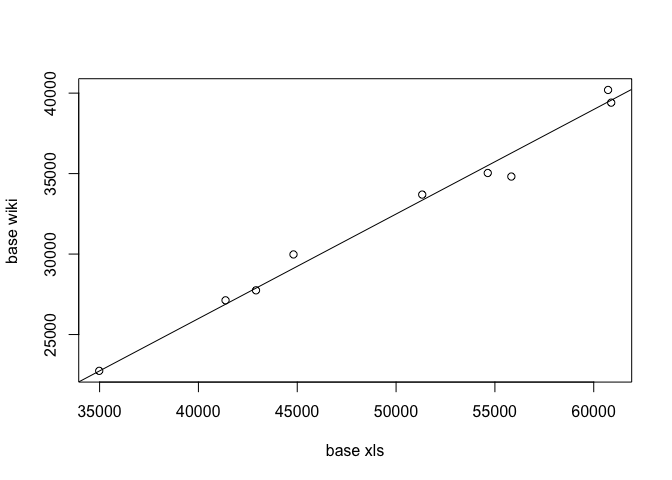
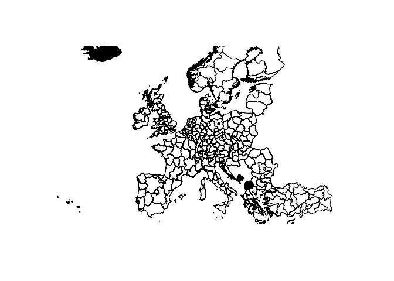
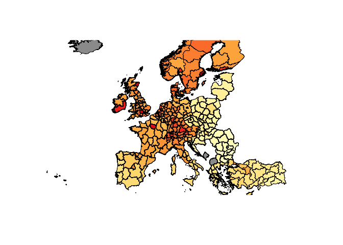

# NUTS

``` r
library(rgdal)
library(rgeos)
library(geodist)
library(mnormt)
library(XML)
library(RColorBrewer)
temp = tempfile(fileext = ".zip")
download.file("http://ec.europa.eu/eurostat/cache/GISCO/geodatafiles/NUTS_2013_01M_SH.zip", temp)
unzip(temp)
EU_NUTS = readOGR(dsn = "./NUTS_2013_01M_SH/data", layer = "NUTS_RG_01M_2013")
```

    OGR data source with driver: ESRI Shapefile 
    Source: "/Users/arthurcharpentier/NUTS_2013_01M_SH/data", layer: "NUTS_RG_01M_2013"
    with 1951 features
    It has 4 fields

``` r
map_nuts2 = subset(EU_NUTS, STAT_LEVL_ == 2) 
newcol <- colorRampPalette(brewer.pal(n = 9, name = "YlOrRd"))
COL100 <- newcol(100)
```

Use <https://www.vlada.gov.sk/data/files/7793_datova_priloha.xlsx> (here
converted as a `csv` file)

``` r
ID = map_nuts2$NUTS_ID
GID = coordinates(gCentroid(map_nuts2,byid=TRUE))

plot(map_nuts2,ylim=c(40,55),xlim=c(5,20),border="light green")
text(GID[,1],GID[,2],ID,cex=.6)
```



``` r
loc = "/Users/arthurcharpentier/7793_datova_priloha/data-Tableau1.csv"
gdpnuts = read.csv(loc,sep=";")

value = function(i){
  idx = which(gdpnuts$nuts == ID[i])
subgdp = gdpnuts[idx,]
k = max(subgdp$year)
v = c(i,NA,NA)
if(k>0) v= c(i,subgdp[subgdp$year == k,"gdppc"],k)
v
}
VGDP = Vectorize(value)(1:length(ID))
```

``` r
colnames(VGDP) = ID

loc_wiki = "https://en.wikipedia.org/wiki/List_of_OECD_regions_by_GDP_(PPP)_per_capita"
download.file(loc_wiki,destfile = "NUTS_wiki")
tables=readHTMLTable("NUTS_wiki")[[2]]
tables=tables[-1,]
TB = tables[tables$V1 == tables$V1[37],]
x = TB$V4
x = as.numeric(gsub(",","",x))
TB$V4 = x

BASE = data.frame(V2 = ID[1:11],
                  V4bis = VGDP[2,1:11])
TB = merge(TB,BASE)
plot(TB$V4,TB$V4bis,xlab="base xls",ylab="base wiki")
abline(a=0,b=sum(TB$V4bis)/sum(TB$V4))
```



``` r
correctif = sum(TB$V4bis)/sum(TB$V4)
TB$V4corrige = TB$V4*correctif

TB = tables[tables$V1 == tables$V1[22],]
x = TB$V4
x = as.numeric(gsub(",","",x))
TB$V4 = x
TB$V4corrige= TB$V4*correctif
TB_CH = TB

TB = tables[tables$V1 == tables$V1[19],]
x = TB$V4
x = as.numeric(gsub(",","",x))
TB$V4 = x
TB$V4corrige= TB$V4*correctif
TB_NO = TB

TB = tables[tables$V1 == tables$V1[118],]
x = TB$V4
x = as.numeric(gsub(",","",x))
TB$V4 = x
TB$V4corrige= TB$V4*correctif
TB_TR = TB

value = function(i){
  idx = which(gdpnuts$nuts == ID[i])
subgdp = gdpnuts[idx,]
k = max(subgdp$year)
v = c(i,NA,NA)
if(k>0) v= c(i,subgdp[subgdp$year == k,"gdppc"],k)
if(substr(ID[i],1,2)=="CH") v=c(i,TB_CH[TB_CH$V2==ID[i],"V4corrige"],2016)
if(substr(ID[i],1,2)=="NO") v=c(i,TB_NO[TB_NO$V2==ID[i],"V4corrige"],2016)
if(substr(ID[i],1,2)=="TR") v=c(i,TB_TR[TB_TR$V2==ID[i],"V4corrige"],2016)
# if(substr(ID[i],1,2)=="ME")
# if(substr(ID[i],1,2)=="MK")
if(substr(ID[i],1,3)=="UKI") v=c(i,74202*correctif,2016) #LONDRES
v
}

VGDP = Vectorize(value)(1:length(ID))
```

``` r
colnames(VGDP) = ID

plot(map_nuts2,ylim=c(36,65),xlim=c(-9,30),col=is.na(VGDP[2,]))
```



``` r
couleurzone=rep(grey(.3,.6),length(ID))
x = VGDP[2,]
rz = range(x[!is.na(x)])
z = (x-rz[1])/(rz[2]-rz[1])*99+1
couleurzone[!is.na(z)]=COL100[z[!is.na(z)]]
plot(map_nuts2,ylim=c(36,65),xlim=c(-7,30),col=couleurzone)
```



``` r
base_nuts_gdp = data.frame(
  NUTS = ID,
  GDPPC = VGDP[2,]
)

write.csv2(base_nuts_gdp,"base_nuts_gdp.csv")
```
